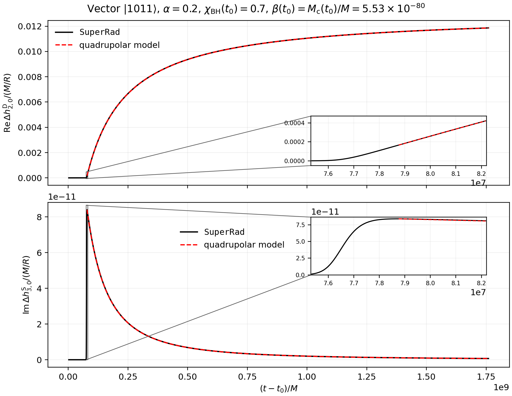
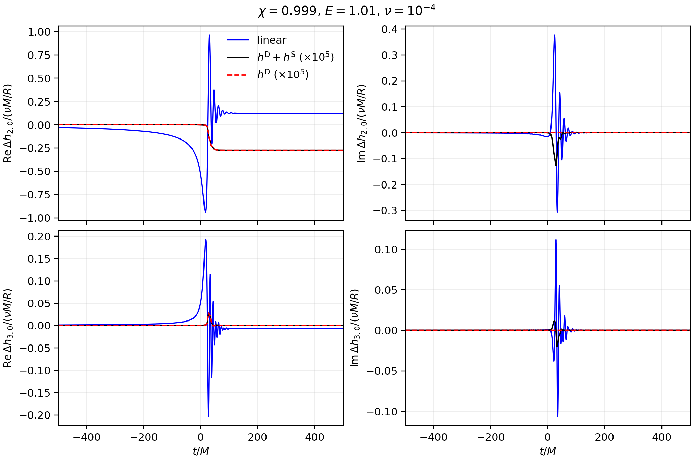

# Memorie

Memorie is a perturbative calculator for vacuum nonlinear-null gravitational-wave memory modes.

Includes:

- displacement, spin, and CM memory evaluators;
- leading-order PN helpers for nonprecessing quasicircular compact binaries;
- a bundled `lmax=10` angular-coupling table for memory-mode calculations.

The bundled angular-coupling table lives at `src/memorie/data/gamma_coeffs_lmax10.npz`. It stores the coefficients for the bilinear combinations of supplied strain modes and their time derivatives. The examples load this table automatically, so they do not regenerate the Wigner-3j coefficients at runtime. When the required coefficients are not present in the bundled table, the code generates them on the fly.

## Install

```bash
pip install -e .
```

For the `SEOBNRv5EHM` example, install `pyseobnr` in the same environment. For the `SEOBNRv5EHM`-vs-`NRHybSur3dq8_CCE` example, install both `pyseobnr` and `gwsurrogate`. For the `FastEMRIWaveforms` example, install `fastemriwaveforms`. For the `SuperRad` example, install `superrad`. For the `qnm` example, install `qnm`.

The waveform models used by the examples are:

- [`SEOBNRv5EHM` through `pyseobnr`](https://github.com/AEI-ACR/pyseobnr)
- [`NRHybSur3dq8_CCE` through `gwsurrogate`](https://github.com/sxs-collaboration/gwsurrogate)
- [`FastEMRIWaveforms`](https://github.com/BlackHolePerturbationToolkit/FastEMRIWaveforms)
- [`SuperRad`](https://www.bitbucket.org/weast/superrad)
- [`qnm`](https://github.com/duetosymmetry/qnm)

## Public Interface

`compute_memory_modes` calculates nonlinear-null memory modes from a dictionary of strain modes:

```python
from memorie import compute_memory_modes

memory = compute_memory_modes(
    t,
    oscillatory_modes,
    targets=[(2, 0), (3, 0)],
    lmax=10,
)

hD20 = memory[(2, 0)]["h_displacement"]
hS20 = memory[(2, 0)]["h_spin_mode"]
hCM20 = memory[(2, 0)]["h_cm_mode"]
```

With the default `include_cm=True`, the result contains $`h^{\mathrm{D}}_{l,m}`$, $`h^{\mathrm{S}}_{l,m}`$, and $`h^{\mathrm{CM}}_{l,m}`$ for every requested $`(l,m)`$.

The calculation uses the supplied strain modes in their given Bondi frame. If a waveform model returns only positive-$`m`$ modes and the source is known to be nonprecessing and reflection symmetric, the missing partners may first be constructed with `complete_nonprecessing_modes`, which applies $`h_{l,-m}=(-1)^l h_{l,m}^{*}`$.

## SEOBNRv5EHM Example

```bash
python examples/seobnrv5ehm_circular_memory_demo.py
```

The example uses `SEOBNRv5EHM` to generate the oscillatory modes of a nonprecessing, quasicircular compact binary. It calculates $`h^{\mathrm{D}}_{2,0}`$, $`h^{\mathrm{S}}_{3,0}`$, $`h^{\mathrm{D}}_{4,0}`$, and the $`h^{\mathrm{CM}}_{l,m}`$ modes shown in the figure. An effective 0PN parameter $`x_{\mathrm{eff}}`$ is inferred from the initial value of $`\dot h^{\mathrm{D}}_{2,0}`$ and used in the 0PN comparisons.

The default initial PN parameter is $`x_0=0.015`$, implemented as `omega_start = 0.015**1.5`. Before calculating CM memory, the example sets $`h^{\mathrm{D}}_{2,0}(t_0)=h^{\mathrm{D},\mathrm{0PN}}_{2,0}(x_{\mathrm{eff}})`$ and $`h^{\mathrm{D}}_{4,0}(t_0)=h^{\mathrm{D},\mathrm{0PN}}_{4,0}(x_{\mathrm{eff}})`$, with $`h^{\mathrm{D},\mathrm{0PN}}_{2,0}(0)=h^{\mathrm{D},\mathrm{0PN}}_{4,0}(0)=0`$. The $`h^{\mathrm{D}}_{2,0}`$ and $`h^{\mathrm{D}}_{4,0}`$ panels show the real part of $`h^{\mathrm{D}}_{l,m}(t)-h^{\mathrm{D}}_{l,m}(t_0)`$, the $`h^{\mathrm{S}}_{3,0}`$ panel shows the imaginary part, and the CM memory panels show $`|h^{\mathrm{CM}}_{l,m}(t)-h^{\mathrm{CM}}_{l,m}(t_0)|_{\mathrm{envelope}}`$.

Warning: `SEOBNRv5EHM` does not provide the $`(3,1)`$ mode, so this example supplements it with its 0PN expression. The truncated calculation uses only the radiative modes retained in the 0PN derivation.

Example outputs:

- `examples/output/seobnrv5ehm_circular_memory_q2_omega0.00183712.csv`
- `examples/output/seobnrv5ehm_circular_memory_q2_omega0.00183712.png`

<p align="center"></p>

## SEOBNRv5EHM and NRHybSur3dq8_CCE Comparison

```bash
python examples/seobnrv5ehm_nrhybsur3dq8_cce_h20_h30_comparison.py
```

At the `NRHybSur3dq8_CCE` time satisfying $`\Omega_{\mathrm{orb}}=0.015^{3/2}`$, this example determines the initial `SEOBNRv5EHM` frequency from the phase of the `NRHybSur3dq8_CCE` $`(2,2)`$ mode. It then compares the changes in the total `NRHybSur3dq8_CCE` modes, $`h_{2,0}(t)-h_{2,0}(t_0)`$ and $`h_{3,0}(t)-h_{3,0}(t_0)`$, with $`h^{\mathrm{D}}_{2,0}`$ and $`h^{\mathrm{S}}_{3,0}`$ calculated from the `SEOBNRv5EHM` oscillatory modes.

Example outputs:

- `examples/output/seobnrv5ehm_nrhybsur3dq8_cce_h20_h30_q2_x0.015.csv`
- `examples/output/seobnrv5ehm_nrhybsur3dq8_cce_h20_h30_q2_x0.015.png`

<p align="center"></p>

## FastEMRIWaveforms Examples

```bash
python examples/fastemriwaveforms_emri_h20_h30_demo.py
```

This example uses `FastEMRIWaveforms` to generate equatorial Kerr trajectories with initial eccentricities $`e_0=0`$ and $`e_0=0.8`$, mass ratio $`q=10^5`$, and spin $`\chi=0.8`$. It calculates $`h^{\mathrm{D}}_{2,0}`$ and $`h^{\mathrm{S}}_{3,0}`$ from the oscillatory modes and compares the $`e_0=0`$ result with the effective 0PN prediction. The calculation retains only the nonoscillatory (“DC”) component of the memory waveform.

With the default `frequency_source = "geodesic"`, the initial frequency parameter for either trajectory is defined by the azimuthal geodesic fundamental frequency: $`x_0=\left[M\Omega_\phi(t_0)\right]^{2/3}`$.

Example outputs:

- `examples/output/fastemriwaveforms_emri_h20_h30_q100000_p0_100_chi0p8.csv`
- `examples/output/fastemriwaveforms_emri_h20_h30_q100000_p0_100_chi0p8.png`

<p align="center"></p>

The additional `fastemriwaveforms_arxiv_2407_19017_h20_comparison.py` example compares $`h^{\mathrm{D}}_{2,0}`$ calculated from `FastEMRIWaveforms` (with effective 0PN extrapolation), with the result reported in [arXiv:2407.19017](https://arxiv.org/abs/2407.19017).

<p align="center"></p>

## SuperRad Example

```bash
python examples/superrad_vector_cloud_h20_h30_demo.py
```

This example uses `SuperRad` to evolve a relativistic vector $`\lvert1011\rangle`$ cloud and calculates $`h^{\mathrm{D}}_{2,0}`$ and $`h^{\mathrm{S}}_{3,0}`$. The calculation retains only the nonoscillatory (“DC”) component of the memory waveform. The red dashed curves are quadrupolar approximations matched to the numerical values at $`t_{\mathrm{sat}}`$ and at the final time. For $`t\geq t_{\mathrm{sat}}`$, $`h^{\mathrm{D}}_{2,0}(t)-h^{\mathrm{D}}_{2,0}(t_{\mathrm{sat}})\propto1-[1+(t-t_{\mathrm{sat}})/\tau_{\mathrm{gw}}]^{-1}`$, while $`h^{\mathrm{S}}_{3,0}(t)-h^{\mathrm{S}}_{3,0}(t_{\mathrm{sat}})\propto1-[1+(t-t_{\mathrm{sat}})/\tau_{\mathrm{gw}}]^{-2}`$.

Example outputs:

- `examples/output/superrad_vector_1011_h20_h30_alpha0p2_chi0p7.csv`
- `examples/output/superrad_vector_1011_h20_h30_alpha0p2_chi0p7.png`

<p align="center"></p>

## Kerr Axial-Plunge Example

```bash
python examples/kerr_axial_plunge_e1p01_h20_h30_demo.py --input-csv INPUT.csv
```

This example calculates the $`(2,0)`$ and $`(3,0)`$ memory modes from the $`(2\le l\le 7,m=0)`$ linear Teukolsky modes of a test body plunging along the north axis of a Kerr black hole. The linear modes are defined by $`h_{l,m}(t=-\infty)=0`$. The parameters are $`E=1.01`$, $`\chi=0.999`$, and $`\nu=10^{-4}`$. The figure shows $`\Delta h^{\mathrm{linear}}_{l,0}`$ in blue, $`10^5\Delta(h^{\mathrm{D}}_{l,0}+h^{\mathrm{S}}_{l,0})`$ in black, and $`10^5\Delta h^{\mathrm{D}}_{l,0}`$ as a red dashed curve.

Example outputs:

- `examples/output/kerr_axial_plunge_e1p01_h20_h30_nu1em04.csv`
- `examples/output/kerr_axial_plunge_e1p01_h20_h30_nu1em04.png`

<p align="center"></p>

## qnm Ringdown Example

```bash
python examples/qnm_kerr_ringdown_220_h20_h30_demo.py
```

This example uses `qnm` to construct the fundamental spin-weighted spheroidal QNM $`(l_{\mathrm{s}},m,n)=(2,2,0)`$ (including the $`m=-2`$ partner) of a Kerr BH with spin $`\chi=0.7`$. Spheroidal-to-spherical mixing preserves $`m`$, so the input waveform has vanishing $`(2,0)`$ and $`(3,0)`$ modes. For $`u=(t-t_0)/M`$ and $`\omega_{220}=\omega_R+i\omega_I`$ with $`\omega_I<0`$, both $`\Delta h^{\mathrm{D}}_{2,0}`$ and $`\Delta h^{\mathrm{S}}_{3,0}`$ are proportional to $`1-e^{2\omega_Iu}`$. The plotted memory modes are normalized by $`|A_{220}|^2`$, with $`A_{220}`$ denoting the spheroidal-mode amplitude at $`t_0`$.

Example outputs:

- `examples/output/qnm_kerr_ringdown_220_h20_h30_chi0p7.csv`
- `examples/output/qnm_kerr_ringdown_220_h20_h30_chi0p7.png`

<p align="center"></p>

## The Rise and Fall of Displacement Memory at Finite Radius

The effective source of null displacement memory can be modeled by $`[r^2T_{ij}(u=t-r,\mathbf{x}=r\mathbf{n})]=\left(\frac{dE_\text{null}}{dud\Omega_\mathbf{n}}\right)_u n_i n_j`$, with $`|\mathbf{n}|=1`$. This describes the null radiation emitted by a point source. Following [Wiseman and Will](https://journals.aps.org/prd/abstract/10.1103/PhysRevD.44.R2945), a solution to the linearized Einstein equation in a flat background (after TT projection) can be written as

$$
h(t,R,\hat{\mathbf{k}})=\sum_{l,m}h_{l,m}(t,R){}_{-2}Y_{lm}(\hat{\mathbf{k}})=\int_{-\infty}^{t-R}\frac{du}{4\pi(t-u)}\int_{\mathbf{n}} \frac{16\pi [r^2T_{ij}(u,\mathbf{x}=r\mathbf{n})]\frac{e_{ij}^+(\hat{\mathbf{k}})-ie_{ij}^\times(\hat{\mathbf{k}})}{2}}{1-\left(\frac{R}{t-u}\right)\mathbf{n}\cdot\hat{\mathbf{k}}}.
$$

It follows that

$$
h_{l,m}(t,R)=\int_{-\infty}^{t-R}du \frac{4}{t-u}\int_{\mathbf{n}} \left(\frac{dE_\text{null}}{dud\Omega_\mathbf{n}}\right)_u F_l(v)Y_{lm}^*(\mathbf{n}),
$$

with $`v=\frac{R}{t-u}\in(0,1]`$ [since $`u=t-r<t-R`$], and

$$
F_l(v)=4\pi\sqrt{\frac{(l-2)!}{(l+2)!}}\frac{(1-v^2)^2}{2v^2}\int_{-1}^1dz \frac{P_l(z)}{(1-vz)^3},
$$

where $`P_l(z)`$ denotes the Legendre polynomial of degree $`l`$. In the null limit, $`F_l(1)=4\pi\sqrt{\frac{(l-2)!}{(l+2)!}}`$.

Denote $`U=t-R`$. In the null-infinity limit $`R\to \infty`$, we have $`v \to 1`$, giving the result:

$$
h_{l,m}(t,R)=\frac{16\pi}{R}\sqrt{\frac{(l-2)!}{(l+2)!}}\int_{-\infty}^{U}du\int_{\mathbf{n}} \left(\frac{dE_\text{null}}{dud\Omega_\mathbf{n}}\right)_u Y_{lm}^*(\mathbf{n})\equiv h_{l,m}^\infty(U).
$$

Relative to the null-infinity limit, the integrand for fixed radius $`R`$ acquires a factor:

$$
\frac{\frac{F_l(v)}{t-u}}{\frac{F_l(1)}{R}}=\frac{(1-v^2)^2}{2v}\int_{-1}^1dz \frac{P_l(z)}{(1-vz)^3}\equiv  \mathcal{A}_l(v),
$$

such that

$$
h_{l,m}(U)=\int_{-\infty}^U du \mathcal{A}_l\left(\frac{1}{1+U/R-u/R}\right) \frac{d h_{l,m}^\infty(u)}{du}.
$$

For given $`R`$ and $`t\to \infty`$, $`v\to \frac{R}{t}\equiv V`$, the finite-radius mode has the late-time asymptotic behavior (assuming that $`\frac{d h_{l,m}^\infty(u\ge u_*)}{du}=0`$)

$$
\lim_{t\to\infty}h_{l,m}(t,R)\sim \mathcal{A}_l(V)h_{l,m}^\infty(u_*),
$$

See also the related discussion by [Caldwell](https://arxiv.org/abs/2506.20751v1). E.g.,

$$
\begin{aligned}
\mathcal{A}_2(V)&=\frac{V \left(5 V^2-3\right)+3 \left(V^2-1\right)^2 \text{arctanh} V}{2 V^4}\overset{V\to0}{\to}\frac{4}{5}V,
\\
\mathcal{A}_3(V)&=\frac{-8 V^5+25 V^3+15 \left(V^2-1\right)^2 \text{arctanh} V-15 V}{2 V^5}\overset{V\to0}{\to}\frac{4}{7}V^2,
\\
\mathcal{A}_4(V)&=-\frac{81 V^5-190 V^3+15 \left(V^2-7\right) \left(V^2-1\right)^2 \text{arctanh}  V+105 V}{4 V^6} \overset{V\to0}{\to}\frac{8}{21}V^3.
\end{aligned}
$$

Recall that $`\mathcal{A}_l(1)=1`$.

<p align="center">  </p><p align="center"><sub>The forgetting curve</sub></p>

At finite radius, the early-time growth of displacement memory is also suppressed relative to its null-infinity counterpart. As a concrete example, consider a quasi-circular binary. At leading PN order,

$$
\frac{d h_{2,0}^\infty(u)}{du}=\frac{128}{105}\sqrt{30\pi}\frac{\nu^2}{R}x^5,
$$

while $`\frac{dx(u)}{du}=\frac{64}{5}\frac{\nu}{M}x^5`$ gives $`x(u)=\left[\frac{5M}{256\nu(u_c-u)}\right]^{1/4}`$. We thus obtain

$$
h_{2,0}(U)=\mathcal{B}\left(\rho\right)h_{2,0}^\infty(U),\quad h_{2,0}^\infty(U)=\frac{2}{21}\sqrt{30\pi}\frac{\nu M}{R}x(U).
$$

with $`\rho=\frac{R}{u_c-U}`$, and

$$
\mathcal{B}(\rho)=\frac{1}{4}\int_0^\infty dz(1+z)^{-5/4}\mathcal{A}_2\left(\frac{\rho}{\rho+z}\right).
$$

In the null-infinity limit, $`\mathcal{B}(\rho\to\infty)\to 1`$. At finite radius, in the ancient-time limit, $`\rho\to 0`$, we find $`\mathcal{B}(\rho)=-\frac{\rho}{5}\ln \rho+\mathcal{O}(\rho)\to 0`$.

A general finite-radius waveform calculator based on this model will be added in a future version.

## Restoration of Displacement Memory in Schwarzschild Scattering

<p align="center">  </p><p align="center"></p>

## References

- Marc Favata, "Post-Newtonian corrections to the gravitational-wave memory for quasicircular, inspiralling compact binaries", [arXiv:0812.0069](https://arxiv.org/abs/0812.0069).
- David A. Nichols, "Spin memory effect for compact binaries in the post-Newtonian approximation", [arXiv:1702.03300](https://arxiv.org/abs/1702.03300).
- David A. Nichols, "Center-of-mass angular momentum and memory effect in asymptotically flat spacetimes", [arXiv:1807.08767](https://arxiv.org/abs/1807.08767).
